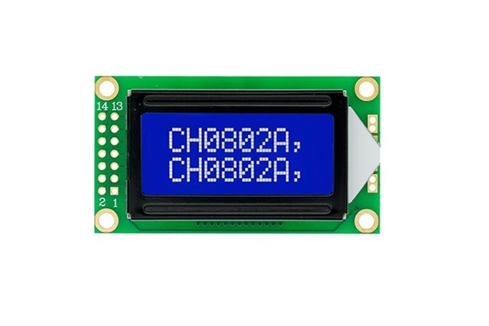

# T12-Solder-station

Just another Solder station using ATMega328 (or variant)

## 1. Main board
- Support only T12 tip that has ~4ohm~ 8ohm heater
- Only work with ATMega168, ATMega328 or newer ATMega328PB
- Use IRF4905 (P-channel) to turn on/off heat element
- Use LMV321 for amplifying thermocouple voltage, not the best but cheap and reliable
- Use buck converter mini360 and linear regulator AMS1117 for high efficiency
- Encoder to control the temperature
- Use homemade opto switch, just a pair of IR LED and IR Reciever Diode (or phototransistor)
- Only need 2 wires to the tip's heat element

Pdf version here <a href='SolderStation_r0.4.pdf'>SolderStation_r0.4.pdf</a>

## 2. Switching PSU
- The 3D printed enclosure only supports this power supply model WX-DC2412, search aliexpress for "WX-DC2412 24V 4A"
- There are a few variants of this power supply have the same mounting holes which work just fine
- Always pick PSU 30% more power capable when your system full-load, ie: full-load 3A -> choose 4A PSU
- Laptop adaptor usually is 19V, using 8ohm tip -> 45w, while 24V PSU will delivery 72w at the tip
- It's better if you have earth prong from main AC 240V connect to the tip, but not neccessary
- Just a warm note: Do not attemp to modify or fix switching PSU, don't try messing with AC 240V

 

## 4. Display
- Only support LCD0802 - 8 char 2 line Character LCD, the main board was designed to piggyback on the LCD
- It is possible to use SSD1306 display via I2C or bitbang SPI for ILI9341 display controller but I haven't written code for this. 
- The 0802 is way nicer in my opinion
 

## 5. Enclosure
- All 3D printed, except for the rubber feet to stop this box from sliding when pressing power button
- Housing a nice Switching PSU, no need for discrete power brick which you can't turn off from this box
- Include stand for the handle with docking mechanism using homemade opto switch
- Include opto switch housing, just need a pair of IR LED and IR receiver diode.
 

## 6. Firmware and calibration
- There are main firmware and calibration firmware for you to play with your own calibration
- Only ATMega328 and variant is supported because of low level code to config timer, pwm, interrupts...
- Only three libraries are used: **avr/interrupt.h, EEPROM.h and LiquidCrystal.h**
- Thermocouple in T12 tip is unknown, not K-type nor C-type, so you can't really use off-the-shelf themocouple amplifier
- I calibrate it by tabulating ADC readings against multiple temperatures, then plotting the chart in excel to find the trend equation: T = ADC*0.403 + 49.6
- The thermal formular T = ADC*0.403 + 49.6 only applies to the amplifier that has gain of 471V/V
- The downside of 10bit ADC is we cannot measure anything below 48mV which is around 50°C
- This guy has some nice work on debunk the myth T12 tip is K-type https://hackaday.io/project/94905-hakko-revenge/log/144548-hakko-t12-thermocouple-is-not-type-k
- Mine is a bit glitchy with EEPROM, sometime it doesn't remember docking function is ON after power off

## 7. T12 Handle
- It would work with pretty much any T12 handle you can buy, but the stand probably won't accept many of them
- There are 2 stand designs for different handle, check the cross section diameter of the handle
- If you want the original aviation GX plug come with the handle, then just short J5 by a jumper and by-pass check for handle

 
 ## 7. Put everything together
  
  

